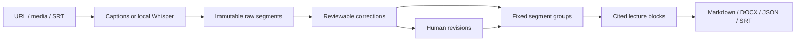

# Architecture

React renders the local task list and lecture workspace. FastAPI listens on loopback. SQLite stores task metadata; task folders store immutable raw transcripts, workspace JSON, revision snapshots, exports and checksummed artifacts. Windows DPAPI protects credentials separately.

One model worker serializes ASR and generation. Checkpoints use input/config fingerprints; changed text regenerates its fixed block. Workspace writes are atomic. Mutations compare the revision captured when editing began. Human decisions are excluded from automatic correction.

## Added local interfaces

- `POST /api/import?filename=...`: raw file bytes; optional provider/profile/source URL.
- `GET /api/jobs/{id}/workspace`: segments, blocks, revision, stage and media state.
- `PATCH /api/jobs/{id}/segments/{sid}`: revision, text and/or accept/reject.
- `PUT /api/jobs/{id}/glossary`: revision and term strings.
- `POST /api/jobs/{id}/regenerate`: optional proofreading; queues processing.
- `GET /api/jobs/{id}/media`: retained decoded WAV with byte ranges.
- `DELETE /api/jobs/{id}/media`: clears app-owned copies, retains text.
- `GET /api/jobs/{id}/export?format=md|docx|json|srt`: current snapshot, no model calls.

These alpha local interfaces are not a stable SDK. Clients use task IDs, never arbitrary filesystem paths. Existing task lifecycle routes remain available.

Migration version 2 adds input type/name and backs up existing databases. Old DOCX files remain available. Old transcripts acquire IDs on opening; old summaries are not treated as verified citations.

Checkpoints preserve completed work, not in-flight calls. History restoration is currently manual. This alpha produces cited sections rather than a separately generated global synopsis. Unsupported codecs, web-source changes and ASR omissions remain possible.
