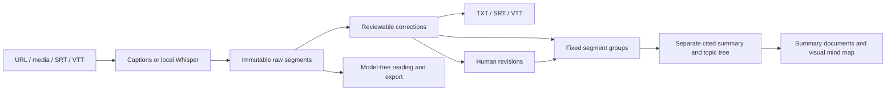

# Architecture

React renders the desktop task list, transcript editor, summary, and topic map. The phone client is served by a separate authenticated API. FastAPI listens on loopback. SQLite stores task metadata; task folders store immutable raw transcripts, workspace JSON, revision snapshots, exports and checksummed artifacts. Windows DPAPI protects credentials separately.

One model worker serializes ASR and generation. Checkpoints use input/config fingerprints; changed text or glossary terms invalidate derived results. Summary and topic-tree generation use separate schemas and checkpoints over shared transcript groups. Workspace writes are atomic. Mutations compare the revision captured when editing began. Human decisions are excluded from automatic correction.

## Added local interfaces

- `POST /api/import?filename=...`: raw file bytes; optional provider/profile/source URL, processing_mode=transcript|lecture, transcription_device=gpu|cpu.
- `POST /api/demo`: bundled original transcript example, no ASR/LLM/network calls.
- `GET /api/settings/local-models`: installed Ollama model names.
- `GET /api/jobs/{id}/workspace`: segments, summary, mindmap, compatibility blocks, revision, stage and media state.
- `PATCH /api/jobs/{id}/segments/{sid}`: revision, text and/or accept/reject.
- `PUT /api/jobs/{id}/glossary`: revision and term strings.
- `POST /api/jobs/{id}/regenerate`: optional proofreading and llm_provider; queues summary and topic-tree generation from the existing transcript. The internal processing_mode value remains lecture for compatibility.
- `GET /api/jobs/{id}/media`: retained decoded WAV with byte ranges.
- `DELETE /api/jobs/{id}/media`: clears app-owned copies, retains text.
- `GET /api/jobs/{id}/export?format=md|docx|json|srt|vtt|txt|outline`: current snapshot, no model calls. Without lecture blocks, Word and Markdown contain the full transcript. Outline exports use the current topic tree. Missing or invalidated maps produce an explicit message rather than falling back to lecture paragraphs.

Workspace segment `source_url` values are derived safe platform time links and are not written into revision history. Both clients use src/mindmapCanvas.ts with Markmap to render the separately generated mindmap tree. The phone bundle is embedded in mindmap_assets.py by scripts/build_mindmap.mjs and served at /mindmap.js, without a runtime CDN dependency. Node labels are escaped as text; source navigation resolves saved segment IDs. The task list returns all metadata (no transcript contents); filtering is local and cards render 50 at a time. This keeps old materials discoverable; very large libraries will need server-side pagination later.

These alpha local interfaces are not a stable SDK. Clients use task IDs, never arbitrary filesystem paths. Existing task lifecycle routes remain available.

Migration version 3 adds processing mode/device and backs up existing databases to `.pre-v3.bak`. Existing tasks retain lecture mode; new UI tasks default to transcript-only. Old DOCX files remain available. Old transcripts acquire IDs on opening; old summaries are not treated as verified citations.

Checkpoints preserve completed work, not in-flight calls. History restoration is currently manual. This alpha produces cited sections rather than a separately generated global synopsis. Unsupported codecs, web-source changes and ASR omissions remain possible.
